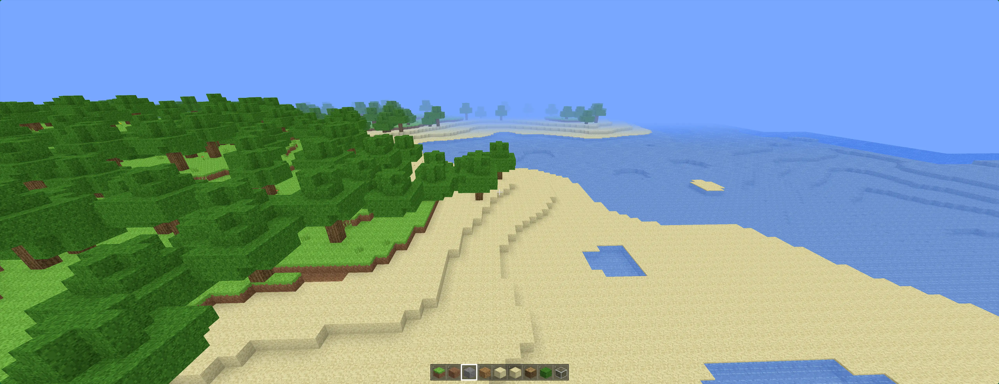
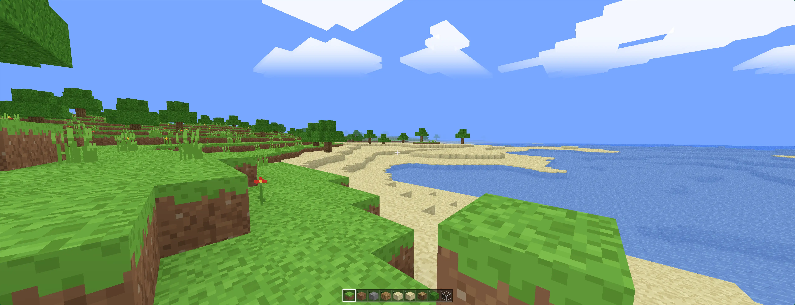

# Minecraft Web 复刻

非官方粉丝复刻项目，所有贴图/音效为程序生成的原创内容.

使用 Vite + TypeScript + three.js 构建的体素沙盒。方块模型定义在运行时通过
HTTP 从 `public/models/` 加载（Minecraft 风格 `parent`/`textures`/`elements` 格式），
贴图为代码绘制的 16×16 原创像素画图集，音效为 WebAudio 实时合成。

## 运行

```bash
npm.cmd install
npm.cmd run dev      # 开发
npm.cmd run build    # 产物输出到 dist/
npm.cmd run preview  # 预览构建产物
```

## 操作

| 按键                 | 功能                             |
| -------------------- | -------------------------------- |
| 点击画面             | 锁定鼠标进入游戏                 |
| WASD / Space / Shift | 移动 / 跳跃 / 潜行（边缘防坠落） |
| 双击 Space           | 切换飞行（Space 升 / Shift 降）  |
| 鼠标左键（按住）     | 挖掘（按硬度计时，带裂纹阶段）   |
| 鼠标右键             | 放置方块                         |
| 滚轮 / 1-9           | 快捷栏选择                       |
| F3                   | 调试信息                         |
| ESC                  | 释放鼠标（暂停提示）             |

## 技术要点

- 单图集 `NearestFilter`、无 mipmap，自定义 shader 按格内 `fract` UV 采样，支持贪心合并后的重复贴图且不串格
- 每区块贪心网格化（隐藏面剔除 + 同贴图/AO 矩形合并），Web Worker 池并行，Transferable 零拷贝回传
- 方向性面明暗 + 逐顶点 AO 烘焙进顶点色，`MeshBasicMaterial` 无光照计算，昼夜只调全局亮度系数
- 逐轴 AABB 碰撞、DDA 射线、双 Space 飞行、水中游泳、潜行防坠落

## 效果



